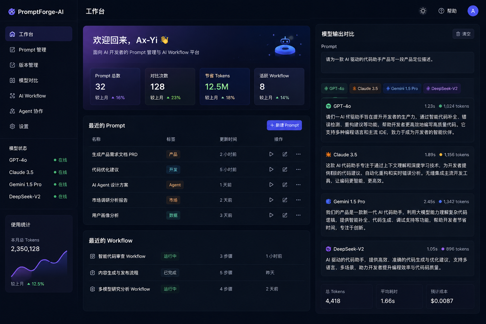

## Preview

# PromptForge-AI

基于多模型协作的 AI Prompt Playground 平台。

支持 GPT、Claude、Gemini、DeepSeek 等模型统一管理与输出对比。

---

# 🚀 项目简介

PromptForge-AI 是一个面向 AI 开发者的 Prompt 管理与 AI Workflow 平台。

项目主要用于：

- Prompt 管理
- 多模型输出对比
- Prompt Version 管理
- AI Workflow 实验
- Agent 协作开发

适合作为：

- AI Agent 项目
- Prompt Engineering 平台
- AI Coding Workflow Demo
- 多模型协同开发工具

---

# 🧠 当前支持模型

- GPT 系列
- Claude 系列
- Gemini 系列
- DeepSeek 系列

---

# ⚡ 核心功能

## Prompt Workspace

支持：

- Prompt 创建
- Prompt 编辑
- Prompt 收藏
- Prompt 标签分类
- Prompt 历史版本

---

## 多模型输出对比

同一个 Prompt：

可同时调用：

- GPT
- Claude
- Gemini
- DeepSeek

统一展示输出结果。

支持：

- Token 消耗统计
- 响应速度统计
- 输出结果 Diff
- Cost 分析

---

## Prompt Version 管理

类似 Git Version：

- Prompt v1
- Prompt v2
- Prompt v3

支持 Prompt 回滚。

---

## AI Workflow

支持：

- Prompt Workflow
- 多 Agent 协作
- 自动化 Prompt 优化
- AI 工具调用

---

# 🛠 技术栈

## Frontend

- Next.js
- React
- TailwindCSS
- shadcn/ui

## Backend

- Supabase
- PostgreSQL

## AI Models

- OpenAI API
- Claude API
- Gemini API
- DeepSeek API

---

# 📂 项目结构

```bash
app/
components/
lib/
api/
public/
```

---

# 📌 开发路线

- [x] 项目初始化
- [x] README 构建
- [ ] 多模型 API 接入
- [ ] Prompt Version 系统
- [ ] Agent Workflow
- [ ] Prompt Marketplace
- [ ] VSCode Extension

---

# 📖 项目方向

项目主要围绕：

- Prompt Engineering
- AI Agent
- AI Workflow
- Multi-Agent Collaboration
- LLM 对比
- AI Coding Tools

展开实践。

---

# ⭐ 后续规划

计划增加：

- RAG 检索系统
- 向量数据库
- Prompt 自动优化
- Agent Planning
